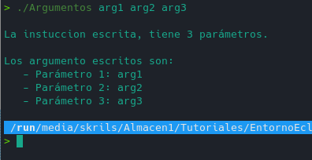

## Proyecto Argumentos

Programa simple en el que se comtrola los argumentos pasados por consola y los imprime en pantalla. 

El uso es fácil y las salidas a mostrar son las siguientes: 

  * En el caso de que no se esccriban parámentros:

  * En el caso que se escriban parámetros:
  
  

***

